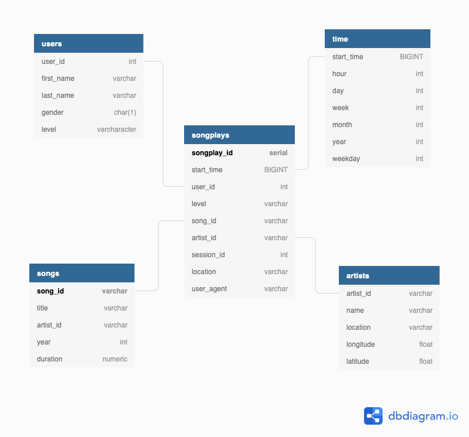

# Data Lakes with Apache Spark
---

The purpose of this project is to create a data lake for a startup Sparkify and build an ETL (Extract,Transform,Load) process moving data from s3, processing it with spark and saving it back into s3

## Schema Design

This project uses the star schema . It has 1 fact table and 4 dimensions table. The data is thus denormalized. The star schema also allows for fast aggregations. Thus the database is optimized for reads. The diagram below shows the nature of the star schema for this project



## ETL PIPELINE
ETL processes found in the etl.py is used to populate songs and artists tables from the  s3 bucket extracted and transformed using spark session and loaded into back as tables in s3 for use.


## Installation
### Create a IAM User on AWS:
 - Create an IAM role by going to AWS IAM, if you have an AWS account or signup for AWS , click the user options, creating new user role
 - Copy the following information from the IAM user info when it has been created and replace the sample below with the information in the dwh.cfg file :
   ```
    [AWS]
    AWS_ACCESS_KEY_ID=
    AWS_SECRET_ACCESS_KEY=
   ```
- Ensure your s3 bucket is in the same region as your redshift


### Run the files
- Run etl.py to carryout extract, transform and load

```
 python etl.py
```
